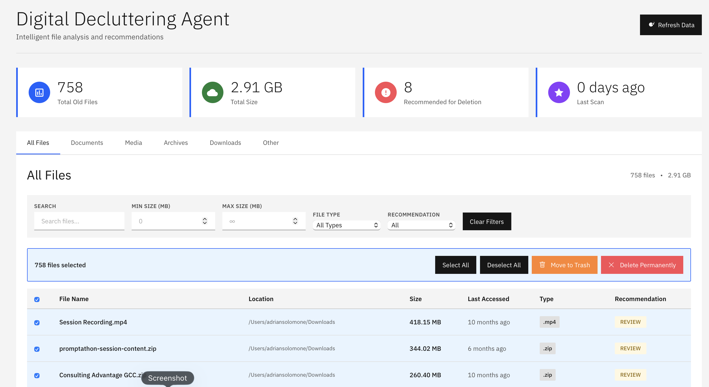

# Digital Decluttering Agent

An intelligent file analysis and cleanup tool with an interactive web dashboard for managing old, unused files on your Mac.

## 🎯 Features

### File Scanning
- ✅ Scans user directories (Desktop, Documents, Downloads, Pictures, Movies, Music)
- ✅ Identifies files not accessed in over 180 days
- ✅ Excludes system files and development artifacts
- ✅ Generates detailed Excel reports with file metadata
- ✅ Monthly automated scanning with notifications

### Interactive Dashboard
- ✅ IBM Design Language with professional styling
- ✅ Real-time file visualization and filtering
- ✅ Intelligent file categorization (Documents, Media, Archives, Downloads, Other)
- ✅ Smart recommendations (DELETE, ARCHIVE, REVIEW, KEEP)
- ✅ Advanced filtering (search, size, file type, recommendation)
- ✅ Interactive file selection and deletion**
- ✅ Bulk operations (select all, deselect all)**
- ✅ Safe deletion (Move to Trash or Permanent Delete)**

## 📸 Screenshot


*Interactive dashboard with IBM Design Language showing file analysis and cleanup tools*

## � Quick Start

### 1. Run a Scan
```bash
cd ~/Bob/"Digital Decluttering agent"
./"Digital Decluttering agent"
```

### 2. Launch Dashboard

Choose your preferred method:

#### Option A: Double-Click (Easiest) 🖱️
1. Navigate to `~/Bob/Digital Decluttering agent/` in Finder
2. Double-click `launch.command`
3. Dashboard opens automatically!

#### Option B: Desktop Shortcut 🖥️
```bash
cd ~/Bob/"Digital Decluttering agent"
./create_desktop_shortcut.sh
```
Then double-click "Digital Decluttering Dashboard.command" on your Desktop

#### Option C: Global Command 💻
```bash
cd ~/Bob/"Digital Decluttering agent"
./install_global_command.sh
```
Then run from anywhere:
```bash
declutter
```

#### Option D: Manual Command 📝
```bash
cd ~/Bob/"Digital Decluttering agent"
./start_dashboard.sh
```

The dashboard will open at `http://localhost:8080`

> **⚠️ Important:** Always use one of these methods to launch the dashboard. Do NOT open `index.html` directly in your browser, as it won't load the data properly.

### 🎨 Create a Custom App with Your Icon

Want a proper macOS app with a custom icon?

**Quick setup:**
```bash
# 1. Add your icon.png to the project directory (optional)
# 2. Create the app
./create_app_launcher.sh
```

This creates **"Digital Decluttering Dashboard.app"** that you can:
- ✅ Double-click to launch (with your custom icon!)
- ✅ Drag to your Dock for quick access
- ✅ Move to Applications folder
- ✅ Place on Desktop

**For detailed icon customization**, see [CUSTOM_ICON_GUIDE.md](CUSTOM_ICON_GUIDE.md):
- Creating icons from emojis (easiest method)
- Free icon resources
- Design tips and recommendations

## 📊 Dashboard Features

### File Selection
- **Individual Selection**: Click checkboxes next to files
- **Bulk Selection**: Use "Select All" / "Deselect All" buttons
- **Header Checkbox**: Select all visible files at once
- **Visual Feedback**: Selected files highlighted in blue

### Deletion Options

#### 🗑️ Move to Trash (Recommended)
- Safely moves files to macOS Trash
- Files can be recovered if needed
- Single confirmation required

#### ⚠️ Delete Permanently
- Permanently deletes files from disk
- **Cannot be recovered**
- Double confirmation required
- Use with extreme caution

### Filters
1. **Search**: Find files by name or path
2. **Size Range**: Filter by minimum/maximum file size
3. **File Type**: Filter by extension (.zip, .pptx, .docx, etc.)
4. **Recommendation**: Filter by DELETE, ARCHIVE, REVIEW, or KEEP

### Categories
- **All Files**: Complete file list
- **Documents**: PDFs, Word, Excel, PowerPoint, etc.
- **Media**: Images, videos, audio files
- **Archives**: ZIP, RAR, DMG, etc.
- **Downloads**: Files in Downloads folder
- **Other**: Everything else

## 🔒 Safety Features

### System Protection
- Prevents deletion of system files
- Protected directories: `/System`, `/Library`, `/Applications`, etc.
- Permission validation before deletion

### Confirmation System
- Single confirmation for "Move to Trash"
- Double confirmation for "Permanent Delete"
- Clear warnings about irreversible actions

### Real-time Updates
- Dashboard updates automatically after deletion
- Success/failure reporting for each file
- Detailed error messages if deletion fails

## 📋 Example Workflows

### Clean Up Old Downloads
```
1. Click "Downloads" tab
2. Set "Min Size" to 50 MB
3. Select "File Type" → .zip
4. Select files to delete
5. Click "Move to Trash"
```

### Remove Large Media Files
```
1. Click "Media" tab
2. Set "Min Size" to 100 MB
3. Select "Recommendation" → Delete
4. Select files to delete
5. Click "Move to Trash"
```

### Find and Remove Duplicates
```
1. Search for "copy" or "duplicate"
2. Review the results
3. Select confirmed duplicates
4. Click "Move to Trash"
```

## 📁 Project Structure

```
Digital Decluttering agent/
├── file_scanner_user_only.py      # Main scanner script
├── Digital Decluttering agent     # Manual scan launcher
├── start_dashboard.sh             # Dashboard launcher
├── run_scheduled_scan.sh          # Scheduled scan script
├── com.digitalclutter.scanner.plist  # LaunchAgent config
├── dashboard/
│   ├── index.html                 # Dashboard UI
│   ├── app.js                     # Dashboard logic
│   ├── styles.css                 # IBM Design styling
│   ├── api.py                     # Backend API server
│   ├── convert_report.py          # Excel to JSON converter
│   └── data/
│       └── latest_report.json     # Current report data
├── reports/                       # Excel reports (dated)
├── DASHBOARD_GUIDE.md            # Dashboard usage guide
├── INTERACTIVE_DELETION_GUIDE.md # Deletion feature guide
└── README.md                     # This file
```

## 🔧 Technical Details

### Scanner
- **Language**: Python 3
- **Dependencies**: pandas, openpyxl
- **Output**: Excel (.xlsx) with metadata

### Dashboard
- **Frontend**: Vanilla JavaScript, HTML5, CSS3
- **Backend**: Python HTTP server with custom API
- **Design**: IBM Carbon Design System
- **Port**: 8080

### API Endpoints
- `GET /`: Serve dashboard files
- `POST /api/move-to-trash`: Move files to Trash
- `POST /api/delete`: Permanently delete files

## 📖 Documentation

- **[DASHBOARD_GUIDE.md](DASHBOARD_GUIDE.md)**: Complete dashboard usage guide
- **[INTERACTIVE_DELETION_GUIDE.md](INTERACTIVE_DELETION_GUIDE.md)**: File deletion feature guide
- **[RECOMMENDATION_ALGORITHM.md](RECOMMENDATION_ALGORITHM.md)**: How smart recommendations work
- **[SCREENSHOTS_GUIDE.md](SCREENSHOTS_GUIDE.md)**: How to add screenshots to README
- **[CUSTOM_ICON_GUIDE.md](CUSTOM_ICON_GUIDE.md)**: Custom icon setup guide

## 🔄 Automated Scanning

The agent runs automatically on the 1st of each month at 9:00 AM.

### Check Schedule Status
```bash
launchctl list | grep digitalclutter
```

### Manually Trigger Scheduled Scan
```bash
launchctl start com.digitalclutter.scanner
```

### Disable Automated Scanning
```bash
launchctl unload ~/Library/LaunchAgents/com.digitalclutter.scanner.plist
```

## 💡 Best Practices

1. **Review Before Deleting**: Always check file names and locations
2. **Use "Move to Trash" First**: Safer than permanent deletion
3. **Work in Batches**: Delete smaller groups at a time
4. **Use Filters**: Narrow down files before selecting
5. **Backup Important Files**: Always have backups before bulk deletion

## 🆘 Troubleshooting

### Dashboard Won't Start
```bash
# Check if port 8080 is in use
lsof -i :8080

# Kill existing process
kill -9 <PID>

# Restart dashboard
./start_dashboard.sh
```

### Files Not Deleting
- Check file permissions: `ls -la /path/to/file`
- Verify you own the file
- Some system files are protected

### Dashboard Not Updating
1. Click "Refresh Data" button
2. Or reload page (Cmd+R)
3. Run new scan to update report

## 🎨 Design

Built with IBM Design Language:
- **Typography**: IBM Plex Sans
- **Colors**: IBM Carbon color palette
- **Components**: IBM Carbon design patterns
- **Spacing**: IBM spacing scale

## 📝 Notes

- Only scans user-created files (not system files)
- Excludes hidden folders and development artifacts
- Reports include: file path, last access, last modified, size, type
- All dates are relative (e.g., "2 years ago")

## 🔐 Privacy

- All data stays on your local machine
- No external connections or data sharing
- Reports stored locally in `reports/` folder

---

**Made with Bob** 🤖

For detailed guides, see:
- [Dashboard Guide](DASHBOARD_GUIDE.md)
- [Interactive Deletion Guide](INTERACTIVE_DELETION_GUIDE.md)
